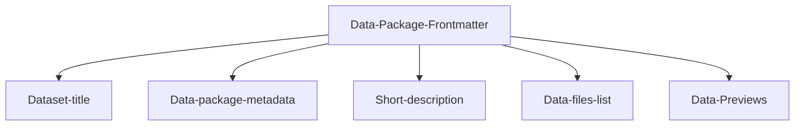

---
datapackage:
  title: Can I publish some survey data
  description: Why is it so freaking hard to publish a dataset with Datahub Cloud?!
  created: 2024-05-22
  updated: 2024-05-22
  licenses:
  - path: http://opendatacommons.org/licenses/pddl/
    title: Some survey data
  sources:
  - path: http://link.to/data/source
    title: Link to data source
  resources:
  - name: c02-per-decade
    title: C02 PPM per decade
    description: C02 PPM per decade
    lastModified: 2024-01-15
    path: frequency-country.csv
---

Welcome to the body of your dataset site. Everything above this section is part of the Data package front matter. 

# Overview

Here is a quick overview of the template structure:

<FlatUiTable
  data={{
    csv: '\n    Year,Temp Anomaly\n    1850,-0.418\n    2020,0.923\n    '
  }}
 />

![[Overview.png]]

## Structured data



Feel free to customize the data package frontmatter accordingly when publishing your own data. 

## Unstructured data

You can add as many markdown files to your GitHub repository as you like, and you can freely nest them in subdirectories. You can also enhance your content with other data visualisation components and markdown features.

> Note: For a full list of supported markdown features visit https://flowershow.app/docs/syntax

Here are some quick examples:

> [!info] This is cool!
> Here's a callout block.
> It supports **markdown** and [[Internal link|wikilinks]].

Or you can quickly embed a piece of code as follows:

```
const ExampleCode = () => {
  return <div> .... </div>;
};
```

## To read more about how this works, refer to the [docs page](docs).

